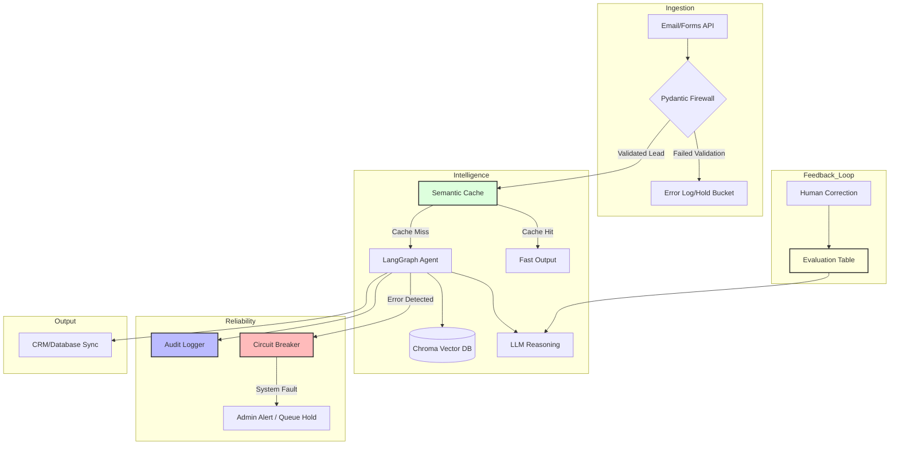

# Agentic Real Estate Lead Processor

## Overview
This project is developed to be an autonomous, agentic system designed to ingest, qualify, and organize real estate leads.

## System Architecture Map

*Explain map later*

## Development Roadmap
This project was developed using a phased, iterative approach, ensuring production grade quality while allowing for agile development. Phase 1 establishes the base of the project, allowing the agent to perform under a limited and monitored scope. This ensures the fundamentals of the projects are implemented accuretly and efficetnly. Phase 2 introduces enterprise-scale resilience, observability, and integration. 

You can see the detailed road map of both phases in [DEVELOPMENT.md](DEVELOPMENT.md).

## Tech Stack
* **Language:** Python
* **Orchestration:** LangGraph
* **Infrence** Ollama (Local LLM)
* **Knowledge** ChromaDB
* **Observability** LangSmith

## Documentation Strategy
I will use a live documentation approach for this project. I will maintain a detailed log to track my decision making process, challenges, and insights. 
