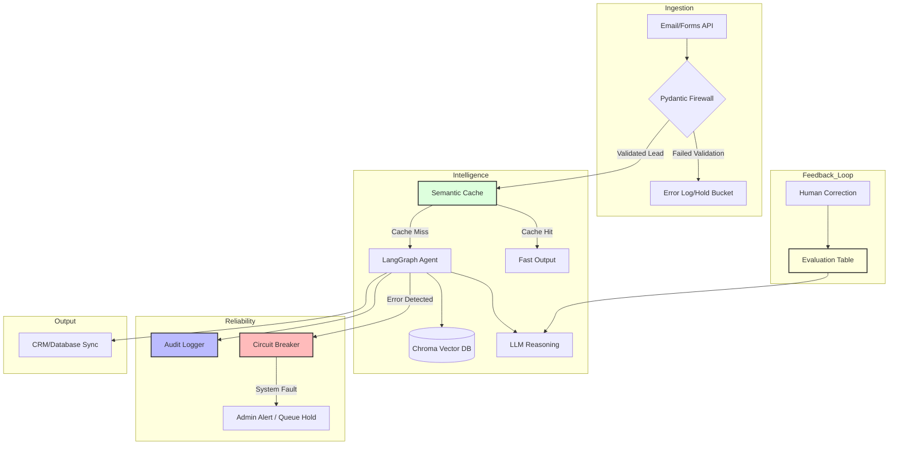

# Agentic Real Estate Lead Processor

## Overview
This project is developed to be an autonomous, agentic system designed to ingest, qualify, and organize real estate leads.

## System Architecture Map

*Explain map later*

## Development Roadmap
*I plan to document the whole development lifecycle, from ideation to production*

ADD ROADMAP HERE

## Tech Stack
* **Language:** Python
* **Orchestration:** LangGraph
* **Infrence** Ollama (Local LLM)
* **Knowledge** ChromaDB
* **Observability** LangSmith

## Documentation Strategy
I will use a live documentation approach for this project. I will maintain a detailed log to track my decision making process, challenges, and insights. 
